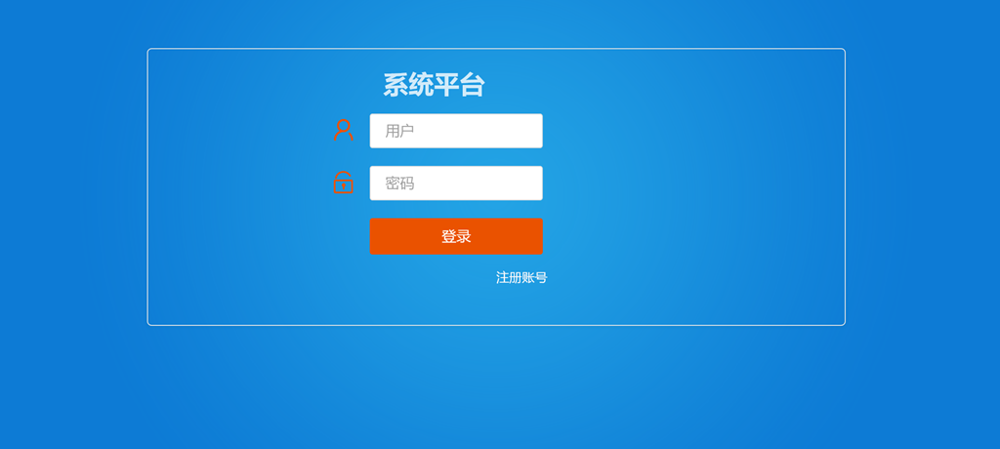
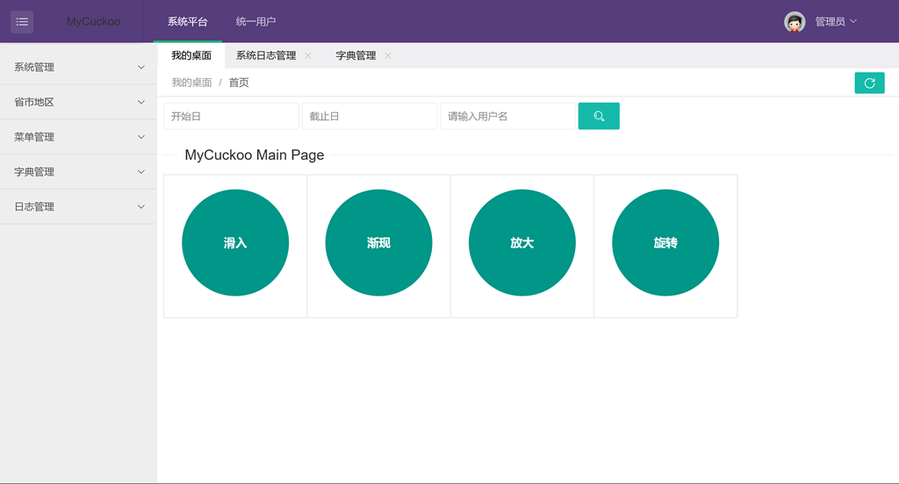
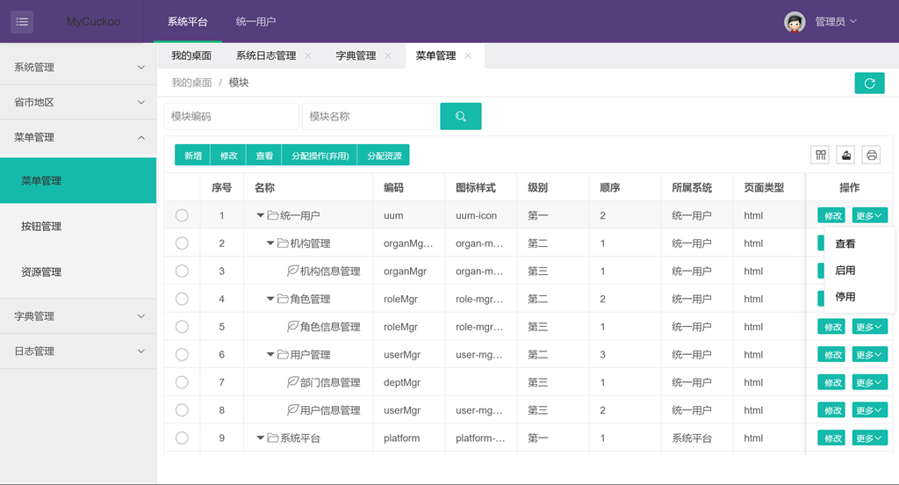
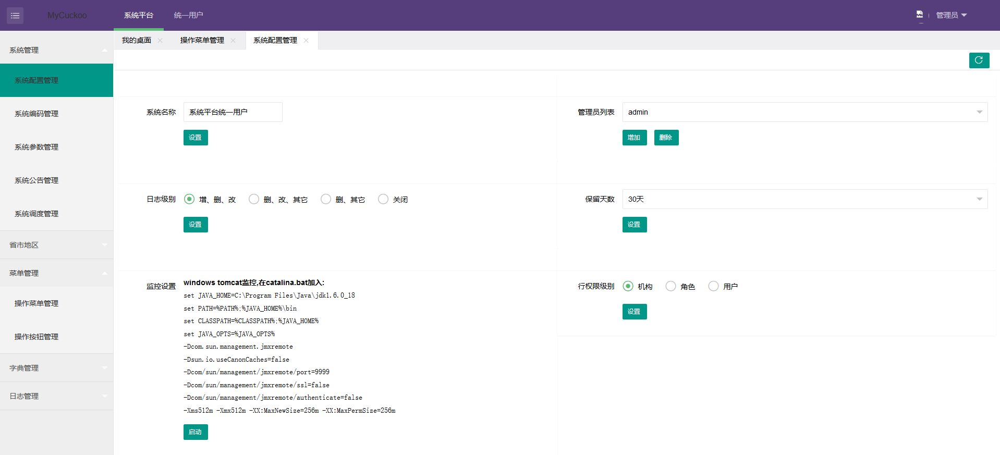

mycuckoo
========

用户权限管理平台, 开发环境java8 spring-boot mybatis

# 前述
1. 此项是笔记, 通过小而完整的一个工程记录遇到的事, 学到的经, 收集点滴
2. 此项是态度, 初有萌芽, 接而立项, 后有执行, 过程曲折, 枯燥乏味, 需心静不变的态度
3. 此项是坚持, 不畏事小, 不烦反复, 没有坚持不会有果

# 特性
1. 分三模块: repository service web
2. 分页插件`PageIntercepter`直接返回分页对象`Page`
3. 基于`NamedThreadLocal`实现的会话工具类`SessionUtil`, 方便获取用户会话信息
4. 存储业务操作日志
5. 登录拦截器`LoginInterceptor`, 权限控制, 跨域请求
6. 全局异常建议`MycuckooExceptionHandler`, 统一异常处理
7. MySQL数据库, 数据库名为`cuckoo`, 附带结构和数据SQL脚本
8. RESTFul接口
9. 搭配前端`mycuckoo-front`, 实现前后端分离

# 安装流程
1. 下载`mycuckoo`、`mycuckoo-front`两个项目源码
2. 请自行网上找MySQL安装, 新建数据库`cuckoo`
3. 打开`mycuckoo`项目, 在里面找到`cuckoo-*.sql`SQL脚本, 导入该脚本到MySQL
4. 然后在MySQL中执行`update.sql`脚本, 注意跟上面步骤顺序
5. 启动`mycuckoo`, 主类是`Mycuckoo`, 默认端口: 8080
6. 打开`mycuckoo-front`前端项目, 找到`public/static/mycuckoo.api.js`文件, 
   修改`host`指向的后台接口地址
7. 浏览器打开`login.html`, 账号密码: `admin/123456`

# 示例:

登录页:

主页:

菜单管理:

系统配置:
