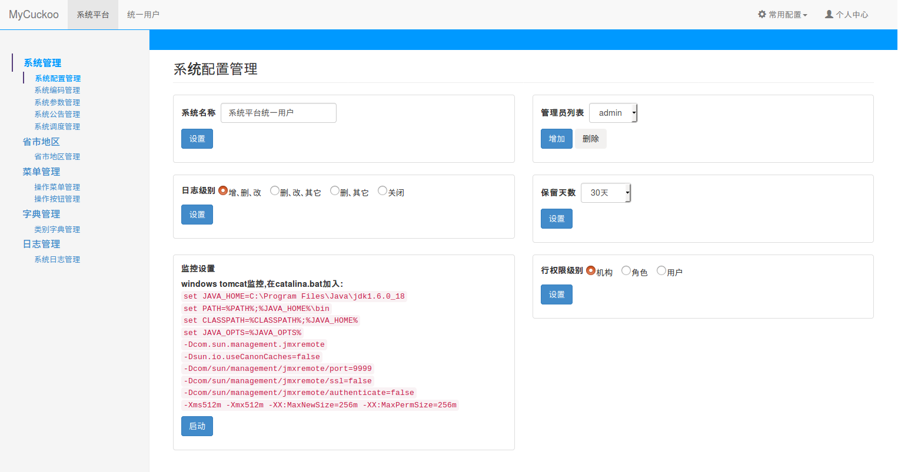

mycuckoo
========

用户权限管理平台, 开发环境java8 spring-boot mybatis

# 前述
1. 此项是笔记, 通过小而完整的一个工程记录遇到的事, 学到的经, 收集点滴
2. 此项是态度, 初有萌芽, 接而立项, 后有执行, 过程曲折, 枯燥乏味, 需心静不变的态度
3. 此项是坚持, 不畏事小, 不烦反复, 没有坚持不会有果

# 特性
1. 分三模块: repository service web
2. 分页插件`PageIntercepter`直接返回分页对象`Page`
3. 基于`NamedThreadLocal`实现的会话工具类`SessionUtil`, 方便获取用户会话信息
4. 存储业务操作日志
5. 登录拦截器`LoginInterceptor`, 权限控制, 跨域请求
6. 全局异常建议`MycuckooExceptionHandler`, 统一异常处理
7. postgres数据库, dbname和schema是`cuckoo`, 附带可导入sql脚本
8. RESTFul接口
9. 搭配前端`mycuckoo-front`, 实现前后端分离

# 安装PostgreSQL数据库
1. 系统 *ubuntu 14.04*
2. 创建 */etc/apt/sources.list.d/pgdg.list* 文件
3. 输入内容：`deb http://apt.postgresql.org/pub/repos/apt/ trusty-pgdg main`
4. 导入仓库签名并更新仓库：  
   `wget --quiet -O - https://www.postgresql.org/media/keys/ACCC4CF8.asc | sudo apt-key add -`  
   `sudo apt-get update`
5. 安装: `apt-get install postgresql-10`
6. 安装完后, 执行: `su - postgres` 切换到 *postgres* 用户, 修改linux系统这个用户的密码请自行搜索资料
7. 执行: `psql` 进入默认数据库
8. 修改用户 *postgres* 的密码: `alter user postgres with password '123456';`
9. 创建数据库: `createdb cuckoo`
10. 还原 `psql -d cuckoo -U postgres -f cuckoo-20171007.sql`

# 示例:

