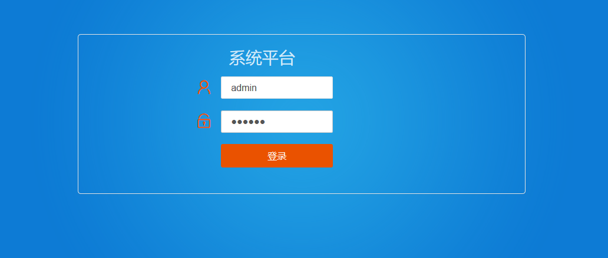
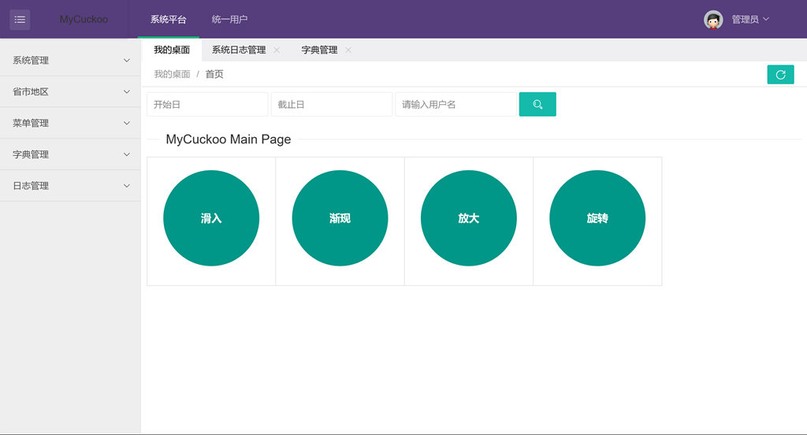
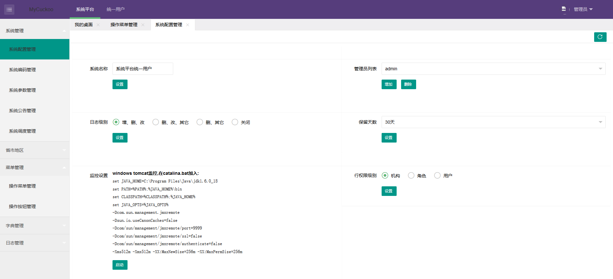

MyCuckoo
========

用户权限管理平台, 最低 Java 17, 推荐 Java 17+ / MySQL 8 / Spring Boot / MyBatis

# 前述 
权限控制是每个管理系统必须且基础的功能。如何更好的设计，达到便利操作和管理，也是较为困难的一件事。  

实现的基本原理跟大多其他权限系统没有太大区别。要是非得说上一样别具特色，表现出有更好改进的地方。

我认为，本权限系统对菜单,按钮,接口资源做了独立拆分，结构清晰，自成管理功能。例如一个菜单作为一项可授权的功能，
底层承载着每个菜单聚合了多个接口资源才能成为一个可用的功能。菜单之间都可能存在一个或多个同一个接口资源的交集，那么接口资源作为
独立管理对象就成了很有必要了。所以这里对接口资源作为单项功能进行管理，当然也便于维护和扩展


# 历史 
4.1.0 版本较之前版本，数据结构和设计实现做了较大的调整。4.0.0 之前版本仅是按钮操作的**伪**控制。
之前也有过**VUE**的**UI**版本，后面放弃维护了，当前版本完全不兼容。

# 特性 
1. 核心模块`core`提供基础工具依赖, `admin`用户权限服务，`gateway`网关服务(试验性，依赖nacos服务注册与发现)
2. 分页插件 `PageIntercepter`, 通过识别接口`Page`类型分页参数, 完成自动分页查询功能
3. SQL增强器 `SqlEnhance`, 实现根据请求参数动态添加参数的SQL过滤条件，解析`@PreAuth`注解添加行数据权限的SQL过滤条件, 最终构建新的查询SQL，达到`SQL`增强目的
4. 日志操作器工具 `LogOperator`, 链式操作，在需要的每个方法增加操作日志记录, 持久入库, 实现每个动作都有迹可循
5. url资源权限过滤器 `PrivilegeFilterr`, 每一个接口都是资源，都有自己的标识, 实现精确控制; 前端页面基于标识实现按钮显示
6. 全局异常处理 `MycuckooExceptionHandler`, 统一异常处理
7. MySQL数据库, 数据库: cuckoo, 附带结构和数据SQL脚本
8. 搭配前端ui: mycuckoo-ui, 实现前后端分离

# 安装流程 
## 源码方式 
1. 下载mycuckoo、mycuckoo-ui两个项目源码  
   `git clone https://github.com/rutine/mycuckoo.git`  
   `git clone https://github.com/rutine/mycuckoo-ui.git`
2. 打开mycuckoo-ui前端项目, 修改`static/mycuckoo.api.js`文件`host`指向后台接口地址,  
   默认指向: http://localhost:8080
3. 使用`maven`, `install` `mycuckoo-ui` 项目安装到本地. 然后修改`mycuckoo-admin`的`pom`文件, 放开对`mycuckoo-ui`的依赖注释.  
   如果使用`nginx`代理静态资源的话, 可以跳过这步, 配置:
   ```nginx
   server {
       listen       8080;
       server_name  localhost;
       
       location / {
           # 这里换成你的目录
           root   D:/java/workspace/mycuckoo-ui;
           index  index.html index.htm;
       }
   }
   ```
4. 安装MySQL(由于默认驱动是8, 请自行网上查找MYSQL8的安装教程), 创建数据库账号: cuckoo/123456, 新建数据库: cuckoo
5. 第一先导入`cuckoo-schema.sql`SQL脚本
6. 第二再导入`cuckoo-repair.sql`脚本, 注意跟上面步骤顺序
7. 启动mycuckoo, 执行主类是`Mycuckoo`的`main`方法, 默认端口: 8080
8. 浏览器输入: http://localhost:8080/login.html, 账号密码: admin/123456
9. 接口文档地址：http://localhost:8080/doc.html

## 启动脚本
当前推荐使用以下脚本作为发布运行入口：

- Windows: `startup.cmd`
- Linux/macOS: `startup.sh`

说明：

- `startup.cmd` / `startup.sh` 已统一为 `-cp + PropertiesLauncher` 方式启动
- 外部配置目录使用 `config`
- 额外依赖包目录使用 `lib`
- 历史 `startup.bat` 不再作为推荐入口


# 示例: 

登录页:


主页:


菜单管理:


系统配置:

